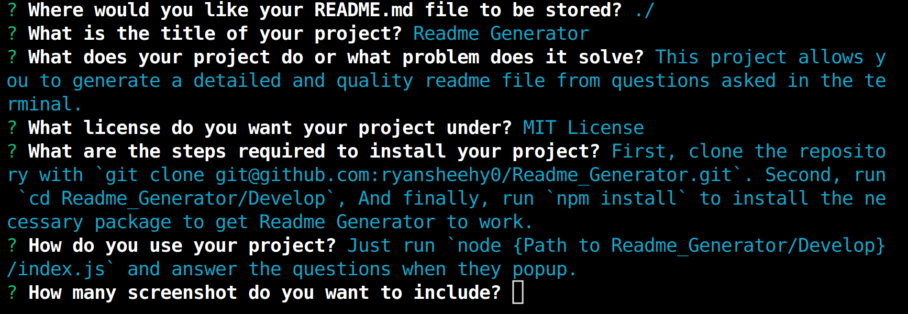

# Readme Generator

## Table of Contents
- [Description](#description)
- [License](#license)
- [Installation](#installation)
- [Usage](#usage)
- [Credits](#credits)
	- [Resources](#resources)
- [Tests](#tests)
- [Issues/Questions](#issuesquestions)
- [Contributing](#contributing)

## Description
This project allows you to generate a detailed and quality readme file from questions asked in the terminal.

## License

## Installation
First, clone the repository with `git clone git@github.com:ryansheehy0/Readme_Generator.git`.  Second, run `cd Readme_Generator/Develop`.  And finally, run `npm install` to install the necessary package to get Readme Generator to work.

## Usage
Just run `node {Path to Readme_Generator/Develop}/index.js` and answer the questions when they popup.

[Video Link](https://drive.google.com/file/d/1BPltTsirZM3QlfxEJPlYpTMfgzorpIxj/view)

## Credits

### Resources
- [inquirer](https://www.npmjs.com/package/inquirer)

## Tests
Just [install](#installation) the project and follow the steps for [using](#usage) the app.

## Issues/Questions
In the [github page](https://github.com/ryansheehy0/Readme_Generator) just click on the issues tab and then click the New issue button. Please try to leave a description of your problem and what steps you took that lead to the problem.

If you have any questions or issues feel free to reach out to me at

Guthub: [ryansheehy0](https://github.com/ryansheehy0)

or

Email: ryansheehy0@gmail.com

## Contributing
First, clone the repo.  Second, make a new branch with `git checkout -b {branch name}`.  Third, create your change in this new branch.  Forth, push your code to your newly created branch.  And finally, make a pull request on the github page.  Please make sure to leave comments on your newly created code.